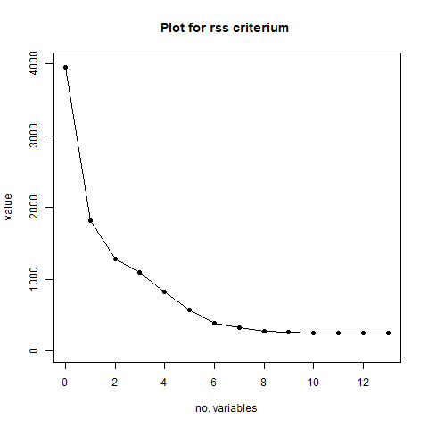
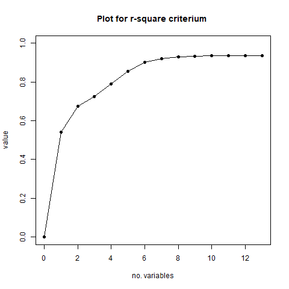

# Forth Homework
This homework was about choosing the best regression sub-model based on different criteria. The search is an exhaustive one.
---

### Let's consider the ["House" data set](house.dat) (Source: Long-KoganRealty, Chicago, USA).
#### The 14 columns correspond, in order, to the following variables:

| Variable        | Name           | Meaning |
| :-------------: |:-------------:| :-----:|
| Y | PRICE           | Selling price of house in thousands of dollars  |
| X1 | BDR | Number of bedrooms |
| X2 | FLR | Floor space in sq.ft. |
| X3 | FP | Number of fireplaces |
| X4 | RMS | Number of rooms |
| X5 | ST | Storm windows (1 if present, 0 if absent) |
| X6 | LOT | Front footage of lot in feet |
| X7 | TAX | Annual taxes |
| X8 | BTH | Number of bathrooms |
| X9 | CON | Construction (0 if frame, 1 if brick) |
| X10 | GAR | Garage size (0 = no garage, 1 = one-car garage, etc.) |
| X11 | CDN | Condition (1 = 'need work', 0 otherwise) |
| X12 | L1 | Location (L1 = 1 if property is in zone A, L1 = 0 otherwise) |
| X13 | L2 | Location (L2 = 1 if property is in zone B, L2 = 0 otherwise) |
  
  

1. To determine for each size p p from 1 to n = 13 the regression model having p variables that optimize, respectively, the Residual Sum of Squares (RSS), R2, R2-adjusted and Cp.
1. Generate the plots fot the four above criteria for dimensions 1, · · ·, n.

1. Select, according to the results obtained at the previous points, the best (sub) model of regression.
##### Observing the above plots, RSS and R-squared tend to favour the biggest model in terms of variables. R-squared adjusted tries to penalize models with more variables and so does Cp. As a conclusion, the sub-model with 7 variables it's the best analysing the above-mentioned criteria.