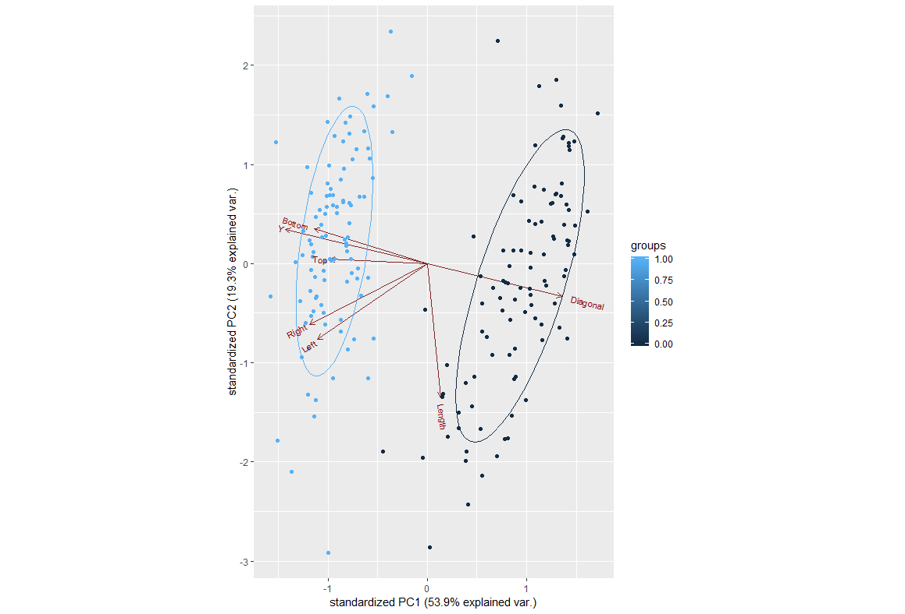

# Sixth Homework
This homework was about interpreting the principal component analysis for a specific, yet interesting dataset.
---

### Let's consider the "Swiss bank notes" data set (H. Riedwyl. "Multivariate Statistics. A Practical Approach, 1988). Apply component analysis on this dataset and interpret the results.

### This principal component analysis reveals something really particular and interesting. We can just use the first two principal components to classify the banknotes!